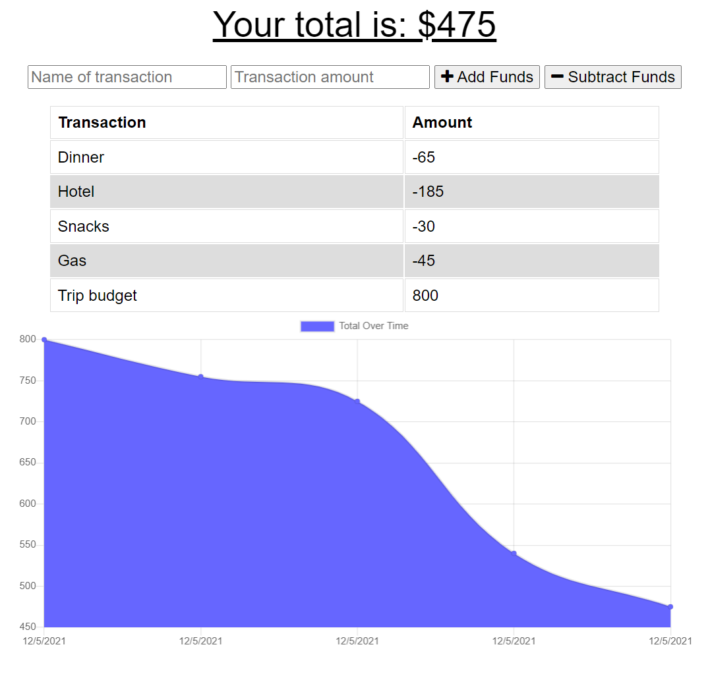

# Budget Tracker
- A Progressive Web Application (PWA) that can be used to track your budget expenses online or off!
- Enter your expenses into the app
- Expenses are tracked in a list as well as a graph over time
- Transactions are stored in a MongoDB database
- When the app is not connected to the internet, transactions are stored in indexedDB
- The app uses a service worker to load the webpage when not connected to the internet
- When a connection is reestablished, the stored transactions are uploaded to the database

## Repository and Deployed Application
- [Repository](https://github.com/SteveB29/offline-travel-expenses)
- [Deployed Application](https://lit-castle-17417.herokuapp.com/)

## Screenshot

## Questions
- [GitHub](https://github.com/SteveB29)
- [Email Me](mailto:steven.bendrick@gmail.com)